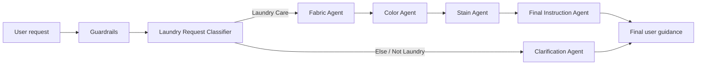

# Laundry Care Agent — Multi-Agent AI System

> Conceptual multi-agent AI system designed to help users make safer, clearer laundry-care decisions based on fabric, colour and stain type.

**Context:** Postgraduate Programme in Artificial Intelligence applied to Marketing — IPAM  
**Module:** Introduction to Artificial Intelligence  
**Co-developed by:** Lisbeth Chavez Oliveira & Luiza Callizo

## Project overview

Laundry decisions often involve several variables at once. A single garment can require different rules because of its fabric, colour and stain type, and those rules may conflict.

The system was designed to reduce common laundry mistakes such as:

- shrinking delicate fabrics,
- damaging colours,
- using the wrong temperature,
- applying an unsafe stain treatment.

Instead of relying on one general-purpose response, the solution decomposes the problem across specialised agents and then combines their outputs into one final user-facing recommendation.

## System architecture

The workflow is sequential: each specialist contributes a specific layer of analysis before the final instruction is generated.

## Agents and responsibilities

| Component | Responsibility |
|---|---|
| **Guardrails** | Validate whether the request can safely continue through the workflow |
| **Laundry Request Classifier** | Determine whether the request is about laundry care or should be redirected |
| **Fabric Agent** | Identify fabric type and define the safest washing approach |
| **Color Agent** | Assess colour-related risks such as separation, temperature and bleach use |
| **Stain Agent** | Identify stain type and recommend a safe pre-treatment approach |
| **Final Instruction Agent** | Combine specialist outputs into one clear, practical response |
| **Clarification Agent** | Handle requests outside the laundry-care scope or requests that cannot be processed clearly |

## Why multi-agent instead of a single agent?

A single agent could generate a generic recommendation, but it may fail to prioritise competing constraints.

For example, a wine stain may require pre-treatment, while a wool garment requires particularly cautious handling. The system therefore separates responsibility across fabric safety, colour protection and stain treatment before producing the final recommendation.

This architecture makes the reasoning process more modular, easier to inspect and easier to debug, while reducing the risk of contradictory advice.

## Example workflow

**User request:**  
> “How should I wash a white wool jumper with a wine stain?”

The workflow processes the request as follows:

1. **Guardrails** — initial validation.
2. **Laundry Request Classifier** — classifies the request as laundry care.
3. **Fabric Agent** — identifies wool as delicate and recommends cold water, a wool/delicate cycle and low spin.
4. **Color Agent** — identifies the garment as white and recommends washing separately while avoiding bleach because the fabric is delicate.
5. **Stain Agent** — identifies wine and recommends gentle pre-treatment with cold water, avoiding heat and aggressive rubbing.
6. **Final Instruction Agent** — combines the outputs into one concise recommendation.

**Illustrative final response:**

> For a white wool jumper with a wine stain, the safest option is cold water and a wool or delicate cycle. Gently pre-treat the stain with cold water and a mild detergent. Wash separately and avoid hot water, bleach, strong spinning and aggressive rubbing. Always check the care label before washing.

## Guardrails and scope control

The project includes a first validation layer before specialist processing. It also uses a classifier to separate supported laundry-care requests from unrelated requests, which are routed to the Clarification Agent.

This is important because agentic systems need not only task capability, but also explicit boundaries around when a workflow should and should not run.

More detail is available in [`docs/guardrails.md`](docs/guardrails.md).

## Agent prompts

The original project also defined structured prompt behaviour for specialist agents, including a Fabric Agent that returns explicit classification flags rather than free-form prose.

A portfolio version of the prompt design is available in [`prompts/agent-prompts.md`](prompts/agent-prompts.md).

## What this project demonstrates

- Multi-agent system decomposition
- Sequential workflow orchestration
- Task routing and classification
- Specialist-agent design
- Guardrails and scope control
- Structured outputs
- Conflict-aware decision logic
- Human-friendly response synthesis
- Practical application of agentic AI to an everyday problem

## Project status

This repository presents the **system design and workflow logic** developed for the academic project. It should be read as a conceptual agentic-AI architecture and portfolio case study, not as a claim of a production laundry-care application deployed at scale.

## Documentation

- [`docs/architecture.md`](docs/architecture.md) — system components and orchestration logic
- [`docs/guardrails.md`](docs/guardrails.md) — scope control and safety layer
- [`docs/example-workflows.md`](docs/example-workflows.md) — example request processing
- [`prompts/agent-prompts.md`](prompts/agent-prompts.md) — structured prompt examples from the project

---

### About this portfolio project

This repository reframes an academic group project as a professional case study focused on **agent architecture, orchestration and safe task decomposition**.