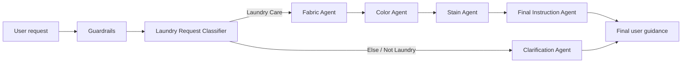

# Laundry Care Agent — Multi-Agent AI System

> Multi-agent laundry-care system with a functional Python prototype that routes requests through guardrails, classification, specialist agents and final-response synthesis.

**Context:** Postgraduate Programme in Artificial Intelligence applied to Marketing — IPAM  
**Module:** Introduction to Artificial Intelligence  
**Co-developed by:** Lisbeth Chavez Oliveira & Luiza Callizo

## Project overview

Laundry decisions often involve several variables at once. A single garment can require different rules because of its fabric, colour and stain type, and those rules may conflict.

The system was designed to reduce common laundry mistakes such as:

- shrinking delicate fabrics,
- damaging colours,
- using the wrong temperature,
- applying an unsafe stain treatment.

Instead of relying on one general-purpose response, the solution decomposes the problem across specialised agents and then combines their outputs into one final user-facing recommendation.

The original academic project defined the **multi-agent architecture and prompt logic**. This portfolio version goes one step further by implementing that architecture as a **working rule-based Python prototype**.

## Functional Python prototype

The repository now includes an executable implementation of the workflow:

```text
User input
   ↓
Guardrails
   ↓
Laundry Request Classifier
   ├── Out of scope → Clarification Agent
   └── Laundry care
          ↓
      Fabric Agent
          ↓
      Color Agent
          ↓
      Stain Agent
          ↓
      Final Instruction Agent
          ↓
      User response
```

The prototype is intentionally **deterministic and rule-based** rather than dependent on an external LLM API. This makes the orchestration, routing and specialist decision logic directly inspectable and runnable without credentials or paid services.

### Run it

From the repository root:

```bash
python app.py "How should I wash a white wool jumper with a wine stain?"
```

To inspect the complete agent trace:

```bash
python app.py "How should I wash a white wool jumper with a wine stain?" --debug
```

The debug mode exposes the structured outputs produced at each stage, making the orchestration easier to inspect and troubleshoot.

### Run the tests

```bash
python -m unittest discover -s tests -v
```

The test suite covers:

- the original white-wool-and-wine example,
- out-of-scope routing to the Clarification Agent,
- guardrail rejection of an empty request,
- a synthetic-fabric / dark-colour / grease-stain workflow.

## Repository structure

```text
ai-agent-laundry-care/
├── app.py
├── laundry_care/
│   ├── __init__.py
│   ├── agents.py
│   ├── models.py
│   └── workflow.py
├── tests/
│   └── test_workflow.py
├── docs/
├── prompts/
├── pyproject.toml
└── README.md
```

## System architecture



The workflow is sequential: each specialist contributes a specific layer of analysis before the final instruction is generated.

## Agents and responsibilities

| Component | Responsibility |
|---|---|
| **Guardrails** | Validate whether the request can continue through the workflow |
| **Laundry Request Classifier** | Determine whether the request is about laundry care or should be redirected |
| **Fabric Agent** | Identify fabric type and define conservative washing constraints |
| **Color Agent** | Assess colour-related risks such as separation, temperature and bleach use |
| **Stain Agent** | Identify supported stain types and recommend a conservative pre-treatment approach |
| **Final Instruction Agent** | Combine specialist outputs into one clear, practical response |
| **Clarification Agent** | Handle requests outside the laundry-care scope or requests that cannot be processed clearly |

## Why multi-agent instead of a single agent?

A single agent could generate a generic recommendation, but it may fail to prioritise competing constraints.

For example, a wine stain may require pre-treatment, while a wool garment requires particularly cautious handling. The system therefore separates responsibility across fabric safety, colour protection and stain treatment before producing the final recommendation.

This architecture makes the workflow more modular, easier to inspect and easier to debug, while reducing the risk of contradictory advice.

## Example workflow

**User request:**  
> “How should I wash a white wool jumper with a wine stain?”

The Python workflow processes the request as follows:

1. **Guardrails** — validates the request.
2. **Laundry Request Classifier** — classifies it as laundry care.
3. **Fabric Agent** — identifies wool as delicate and recommends cold water, a wool/delicate cycle and low spin.
4. **Color Agent** — identifies white and recommends separation while avoiding bleach because the fabric is delicate.
5. **Stain Agent** — identifies wine and recommends gentle cold-water pre-treatment while avoiding heat and aggressive rubbing.
6. **Final Instruction Agent** — combines the structured outputs into one user-facing recommendation.

**Prototype output:**

> Recommended approach: use cold water and a wool or delicate cycle, with low spin. Gently pre-treat with cold water and a mild detergent. Wash the garment separately from dark or strongly coloured items. Avoid heat, aggressive rubbing, bleach, high spin. Always check the garment care label before washing.

## Guardrails and scope control

The implementation includes a first validation layer before specialist processing and a classifier that separates supported laundry-care requests from unrelated requests.

Requests outside the supported domain are routed to the Clarification Agent instead of being processed by the Fabric, Color and Stain agents.

More detail is available in [`docs/guardrails.md`](docs/guardrails.md).

## Agent prompts and structured outputs

The original academic project also defined constrained prompt behaviour for specialist agents, including a Fabric Agent that returned explicit classification flags rather than free-form prose.

The Python prototype preserves the same design principle through structured dataclass outputs and a visible execution trace.

A portfolio version of the original prompt design is available in [`prompts/agent-prompts.md`](prompts/agent-prompts.md).

## What this project demonstrates

- Python implementation of an agentic workflow
- Multi-agent system decomposition
- Sequential workflow orchestration
- Task routing and classification
- Specialist-agent design
- Guardrails and scope control
- Structured outputs with Python dataclasses
- Conflict-aware decision logic
- Debuggable execution traces
- Unit testing
- Human-friendly response synthesis
- Translation of a conceptual AI architecture into a working prototype

## Project status

**Working portfolio prototype.**

The repository now contains both the original system-design documentation and a functional Python implementation of the workflow. The current prototype is rule-based and educational; it is **not** a production laundry-care service, does not provide guaranteed garment-care correctness and is not yet connected to an LLM or external product interface.

Possible future iterations include:

- optional LLM-backed specialist agents,
- richer confidence and uncertainty handling,
- expanded fabric and stain taxonomies,
- a simple web interface,
- logging and evaluation datasets.

## Documentation

- [`docs/architecture.md`](docs/architecture.md) — system components and orchestration logic
- [`docs/guardrails.md`](docs/guardrails.md) — scope control and safety layer
- [`docs/example-workflows.md`](docs/example-workflows.md) — example request processing
- [`prompts/agent-prompts.md`](prompts/agent-prompts.md) — structured prompt examples from the project

---

### About this portfolio project

This repository reframes an academic group project as a professional case study focused on **agent architecture, orchestration, scope control and implementation**.