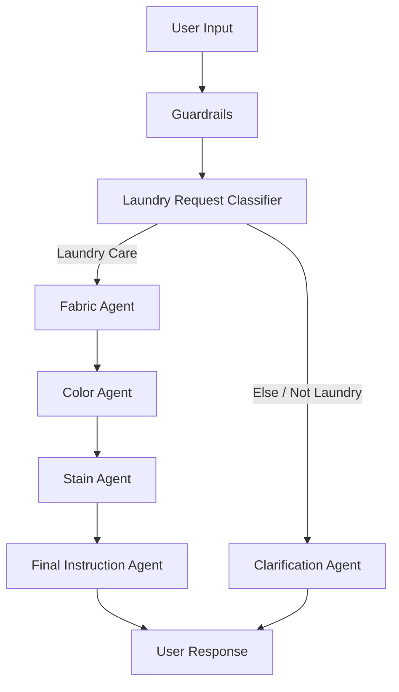

# System Architecture

## Overview

The Laundry Care Agent System uses a **sequential multi-agent workflow**. A user request first passes through validation and classification, then moves through specialist agents before a final instruction is produced.

## Components

### Guardrails
Acts as the first validation layer before the request enters the specialist workflow.

### Laundry Request Classifier
Determines whether the user request is related to washing, drying, ironing, stains, fabrics or clothing care.

Supported requests proceed through the laundry-care workflow. Unsupported requests are routed to the Clarification Agent.

### Fabric Agent
Analyses the garment material and identifies the safest washing approach. The academic project considered categories including cotton, wool, silk, synthetic fabrics, denim, linen and unknown fabrics.

### Color Agent
Evaluates colour-related constraints such as whether the garment should be separated, whether a low temperature is preferable and whether bleach should be avoided.

### Stain Agent
Analyses stain type and recommends a pre-treatment approach. The project considered wine, grease, sweat, ink, coffee, blood and unknown stains.

### Final Instruction Agent
Combines the specialist outputs into one clear user-facing recommendation. It is the only agent responsible for the final answer shown to the user.

### Clarification Agent
Handles requests that are not about laundry care or cannot be processed clearly and asks the user to reformulate within the supported scope.

## Coordination logic

The specialist sequence is:

`Fabric Agent → Color Agent → Stain Agent → Final Instruction Agent`

Each stage contributes a separate decision layer:

1. material risk,
2. colour protection,
3. stain treatment,
4. final response synthesis.

This decomposition is designed to reduce the chance that one generic answer overlooks an important constraint.

## Design rationale

The project chose a multi-agent approach because laundry decisions can contain competing rules. A stain-treatment recommendation may be appropriate in general but unsafe for a delicate fabric. Splitting the task into specialised agents makes the workflow more modular, transparent and easier to debug.